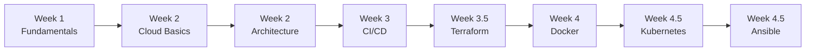

# Sparta Code - DevOps Learning Journey

Welcome to my comprehensive DevOps learning journey through the Tech501 program! This repository chronicles the complete progression from Linux fundamentals to advanced cloud orchestration and infrastructure automation.

## What This Repository Contains

This repository documents my personal learning journey organized chronologically through the Tech501 DevOps training program. Each week built upon previous knowledge, creating a comprehensive understanding of modern infrastructure and deployment practices.

## Learning Progression

## Repository Structure

### 01. Week 1: Fundamentals
**Foundation Building: Linux, Git, Agile**
- Terminal mastery, version control, and agile methodology

### 02. Week 2: Cloud Deployment
**Theory to Practice: First Cloud Applications**
- Transitioning from local development to cloud deployment

### 03. Week 2: App Deployment Architecture
**Production-Ready Systems: 6-Phase Evolution**
1. Azure: Zero to Running - Basic Azure VM deployment
2. Architecture Evolution - Two-tier application design
3. Scaling Storm - Auto-scaling infrastructure
4. Automation Awakening - Script-based deployment
5. Security Architecture - DMZ and advanced security
6. Monitoring & Observability - Production monitoring

### 04. Week 3: CI/CD
**Automation Pipeline: 4-Phase Development**
1. SSH Foundation Blues - Secure development workflows
2. Jenkins Automation - Build and deployment pipelines
3. Cloud Architecture - Production infrastructure design
4. Optimization Quest - Performance and efficiency improvements

### 05. Week 3.5: Terraform
**Infrastructure as Code**
- Declarative infrastructure management

### 06. Week 4: Docker
**Containerization Revolution**
- Application packaging and isolation

### 07. Week 4.5: Kubernetes
**Container Orchestration: 6-Phase Mastery**
1. Foundation Simple - Basic pod and deployment concepts
2. Database Dilemma - Persistent storage challenges
3. Scaling Symphony - Horizontal Pod Autoscaling (HPA)
4. Timing Trap - Init containers and startup order
5. Cloud Migration - Local to production deployment
6. Automation Evolution - Advanced deployment scripts

### 08. Week 4.5: Ansible
**Configuration Management**
- Declarative system configuration

## Learning Outcomes

By following this journey, you'll understand:

- **Linux System Administration** - Command line mastery and system management
- **Version Control** - Git workflows and collaboration patterns
- **Cloud Infrastructure** - Azure/AWS deployment and management
- **CI/CD Pipelines** - Automated build, test, and deployment
- **Infrastructure as Code** - Terraform and declarative infrastructure
- **Containerization** - Docker and container best practices
- **Container Orchestration** - Kubernetes deployment and management
- **Configuration Management** - Ansible automation and consistency
- **Security Best Practices** - Network security and access control
- **Monitoring & Observability** - Production system visibility

## How to Use This Repository

### For Sequential Learning
Follow the week-by-week progression to understand how each technology builds upon previous concepts.

### For Specific Topics
Jump directly to any week/topic using the folder structure above.

### For Reference
Use the descriptive file names to quickly locate specific implementation details or troubleshooting guidance.

## Navigation Tips

- Each section contains detailed journey documentation with practical examples
- Code snippets and configuration files are included where relevant
- Troubleshooting notes and lessons learned are documented throughout
- Mermaid diagrams illustrate complex concepts and workflows

## Tools & Technologies Covered

- **Operating Systems**: Linux
- **Version Control**: Git
- **Cloud Platforms**: Azure, AWS
- **CI/CD**: Jenkins
- **Infrastructure as Code**: Terraform
- **Containerization**: Docker
- **Orchestration**: Kubernetes
- **Configuration Management**: Ansible
- **Monitoring**: Various observability tools

---

*This repository represents a complete DevOps learning journey from fundamentals to advanced orchestration. Each section builds upon previous knowledge while providing practical, hands-on experience with modern infrastructure tools and practices.*